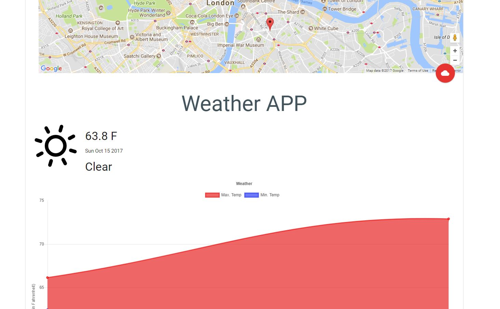

# WeatherApp

## Purpose 

This is a prototype weather application to be used as a reference for the students at CB.

## Anatomy

This application makes use of a few technologies:

- Google Maps API
  - Used for the map and allowing the user to locate themselves or select a location the view the weather of
- VueJS
  - The MVC framework to build the application.
- ChartJS
  - The charting library to create a graph to show the maximum and minimum temperature over the days.
- DarkSky API
  - Weather API to pull weather data from
- Materialize
  - Front-end framework following Google's Material Design specifications

**Note**: The DarkSky API key currently present in the code has been reset so you will need to request your own individual key to be able to retrieve the weather data. This can be done by creating an account at [their website](https://darksky.net/dev)
